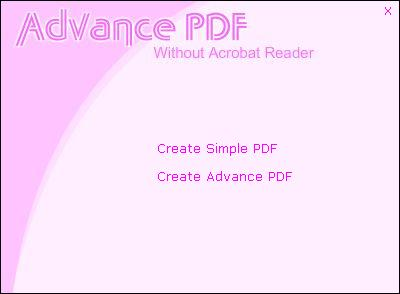

<div align="center">

## Advance PDF Class Without Acrobat Reader


</div>

### Description

Now you can creat PDF files without having Adobe Acrobat Reader or Writer.

Plz plz pleaseeeeeeeeeeeeeeeeeeeeeeeee vote for me
 
### More Info
 


<span>             |<span>
---                |---
**Submitted On**   |2008-04-21 14:39:58
**By**             |[Faizi Baba](https://github.com/Planet-Source-Code/PSCIndex/blob/master/ByAuthor/faizi-baba.md)
**Level**          |Advanced
**User Rating**    |4.4 (106 globes from 24 users)
**Compatibility**  |VB 6\.0
**Category**       |[Windows API Call/ Explanation](https://github.com/Planet-Source-Code/PSCIndex/blob/master/ByCategory/windows-api-call-explanation__1-39.md)
**World**          |[Visual Basic](https://github.com/Planet-Source-Code/PSCIndex/blob/master/ByWorld/visual-basic.md)
**Archive File**   |[Advance\_PD2110234212008\.zip](https://github.com/Planet-Source-Code/faizi-baba-advance-pdf-class-without-acrobat-reader__1-70441/archive/master.zip)

### API Declarations

```
Private Declare Function PDFReadFile Lib "kernel32" Alias "ReadFile" (ByVal hFile As Long, lpBuffer As Any, ByVal nNumberOfBytesToRead As Long, lpNumberOfBytesRead As Long, ByVal lpOverlapped As Any) As Long
Private Declare Function PDFCreateFile Lib "kernel32" Alias "CreateFileA" (ByVal lpFileName As String, ByVal dwDesiredAccess As Long, ByVal dwShareMode As Long, ByVal lpSecurityAttributes As Long, ByVal dwCreationDisposition As Long, ByVal dwFlagsAndAttributes As Long, ByVal hTemplateFile As Long) As Long
Private Declare Function PDFGetFileSize Lib "kernel32" Alias "GetFileSize" (ByVal hFile As Long, lpFileSizeHigh As Long) As Long
Private Declare Function PDFCloseHandle Lib "kernel32" Alias "CloseHandle" (ByVal hObject As Long) As Long
```


